# Random výpisky

-   Alpha je 0.05 (5 procent) většinou

-   Beta se snaží být minimalni

-   Pokud je p-hodnota \< alpha (0.05) zamitame H0

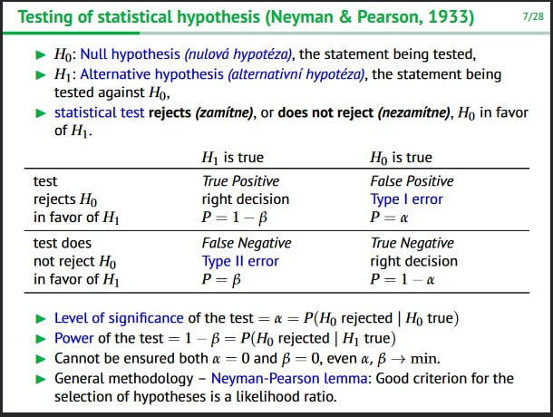{width="466"}

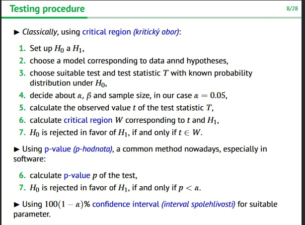{width="465"}

-   Predikce kolem bodu (kdyz prijde nekdo novi)

-   Pokud faktory maji 2 levely tak použiju T-test

    -   The factor A has a ≥ 3 levels - ANOVA

-   stredni hodnota

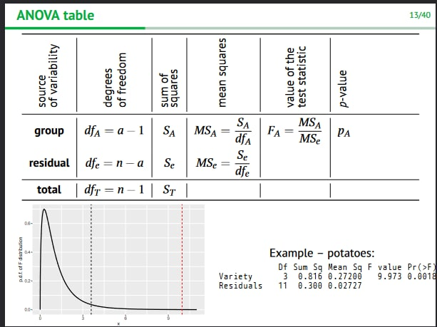{width="453"}

-   Pro výpočet počtu kategorí -> plus 1 tzn:

    -   na obrátzku počet měření ->15, počet kategorií -> 4

strednich hodnot

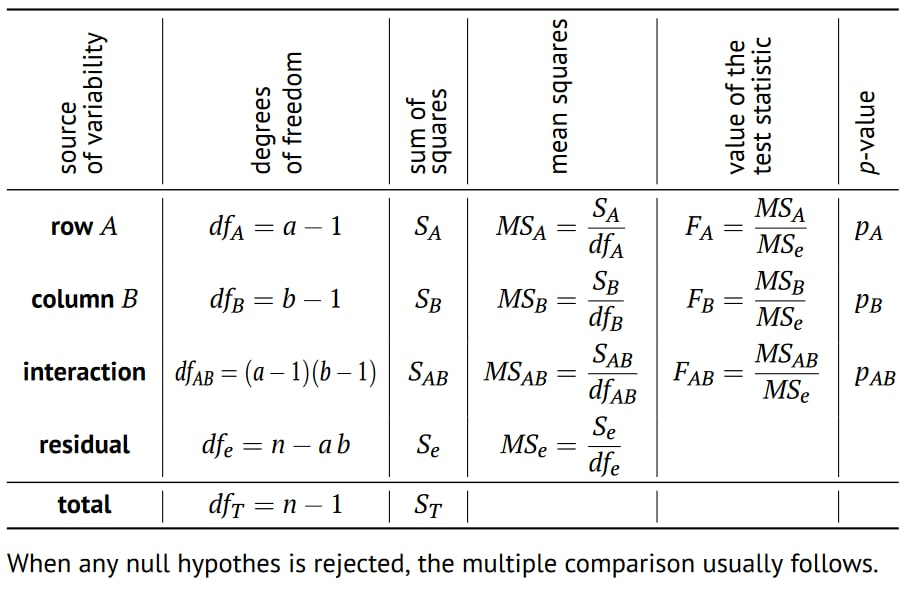{width="438"}

-   Tabulku musím číst odspoda

## Testy

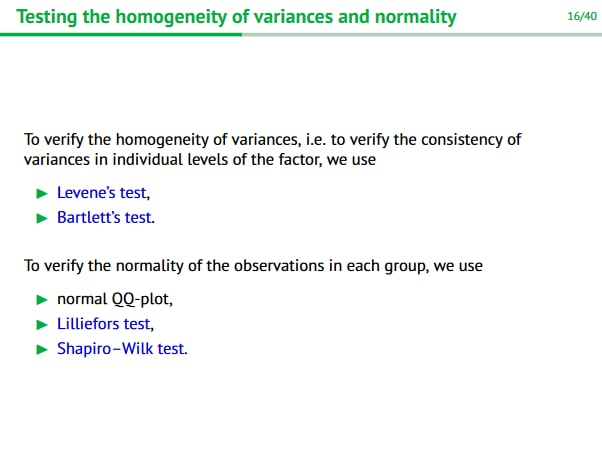{width="453"}

Pro verifikaci normality používáme testy. Tyto testy jsou pro
verifikování zda data jsou modelována pomocí normálního rozdělení a nebo
jsou fakt náhodné

-   Levene's test - If the resulting p-value of Levene's test is less
    than some significance level (typically 0.05), the obtained
    differences in sample variances are unlikely to have occurred based
    on random sampling from a population with equal variances.

-   Bartetts test je to same pro Levene test

Faktory:

-   Lilieforst test nebo Shapiro se používá pro verifikování
    jednotlivých faktorů dat. Ne vždy lze spustit protože potřebujeme
    určítý počet dat

Tohle je zaklad u ANOVY protoze nam to potvrzuje ze s daty muzeme
pracovat (bod 3.)

Pomocí Turkey nebo Scheffe testu nám řekne jestli zamítáme nebo ne a
můžeme udělat pairwise comparission

-   Turkey test - Pokud není na intervalu 0 tak to chci

    -   hodnota je menší a lepší

-   Scheffe test jsou rozdilne skupiny

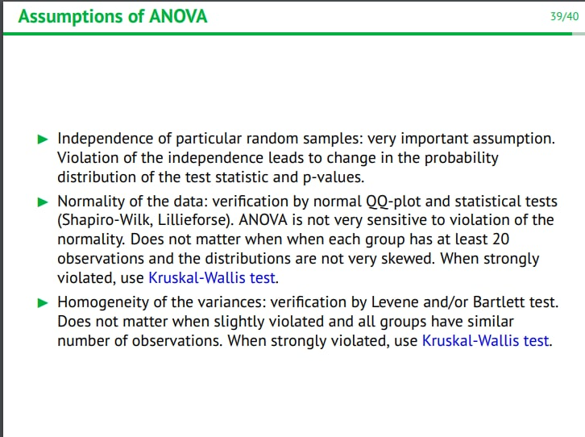{width="453"}

### Rank Tests

Nonparametric tests = Nonparametric tests are used for data that don't
follow the assumptions of parametric tests, especially the assumption of
a normal distribution. Tohle je celkem important.

Velka N co tam skutecne je mala n co o tom rikam ja. p.j je moje
vypočítaná pravděpodobnost pro normalizaci

-   Sign test - determines if one member of the pair (such as
    pre-treatment) tends to be greater than (or less than) the other
    member of the pair (such as post-treatment).

-   The Wilcoxon Sign test is a statistical comparison of the average of
    two dependent samples.

    -   Winconsuv test je v absolutni hodnote

-   Kruskal-Wallis test is the nonparametric alternative to one-way
    between groups ANOVA and generalization of Mann-Whitney-Wilcoxon
    test

-   The median test is a special case of the chi-square test for
    independence. The test has poor statistical power for samples drawn
    from normal or short-tailed distributions, but it is particularly
    effective in detecting shift in location for symmetric and
    heavy-tailed distributions.

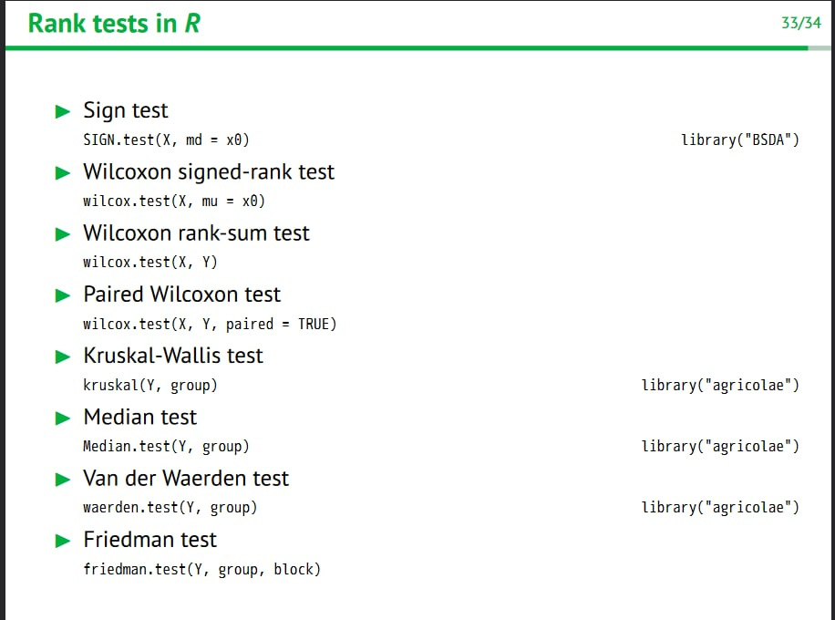{width="445"}

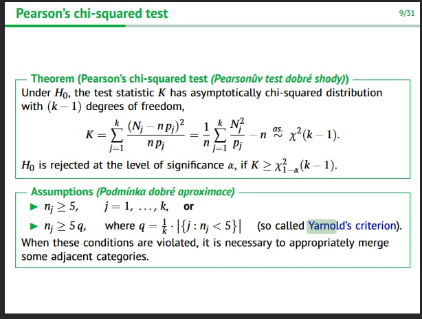{width="447"}

-   Empirical probability is based on the observations of an experiment
    while theoretical probability is based on the assumption that
    outcomes have an equal chance of occurring.

### Prednaska 6

Autocorrelation (autokorelace) of random errors means that the random
errors are correlated, ρ(ε i , ε j ) ̸= 0.

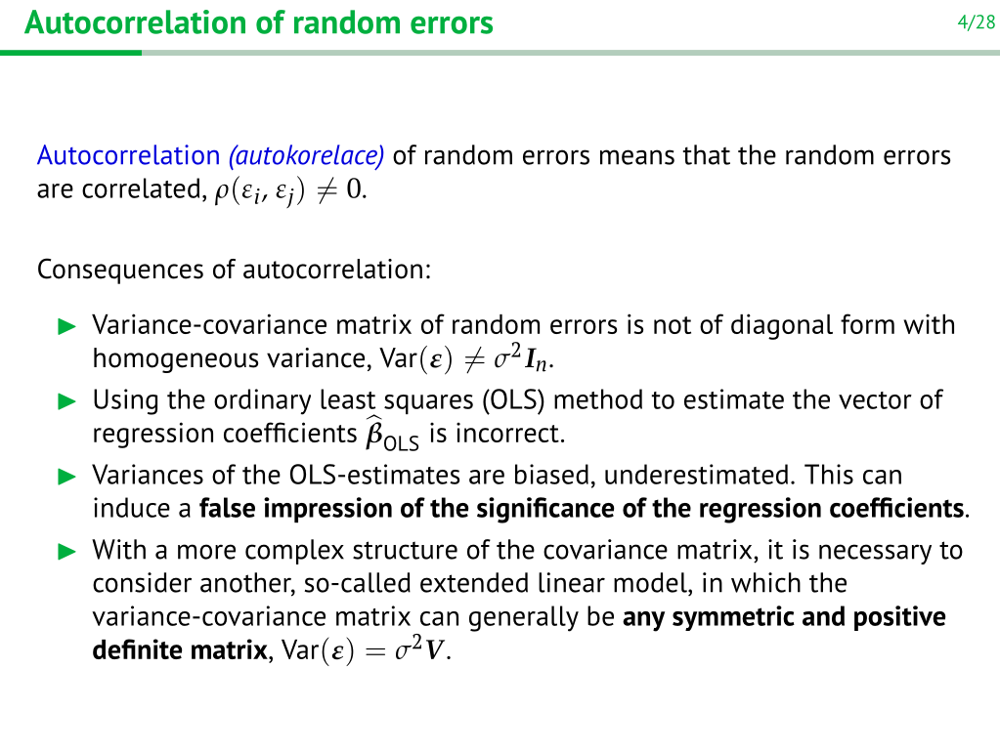{width="546"}

Autoregression (autoregrese) AR(p) of random errors is a special form of
relationship between consecutive errors.

Durbin-Watson test is used to detect the autoregression. It uses so
called Durbin-Watson test statistic D ∈ [0, 4].

\
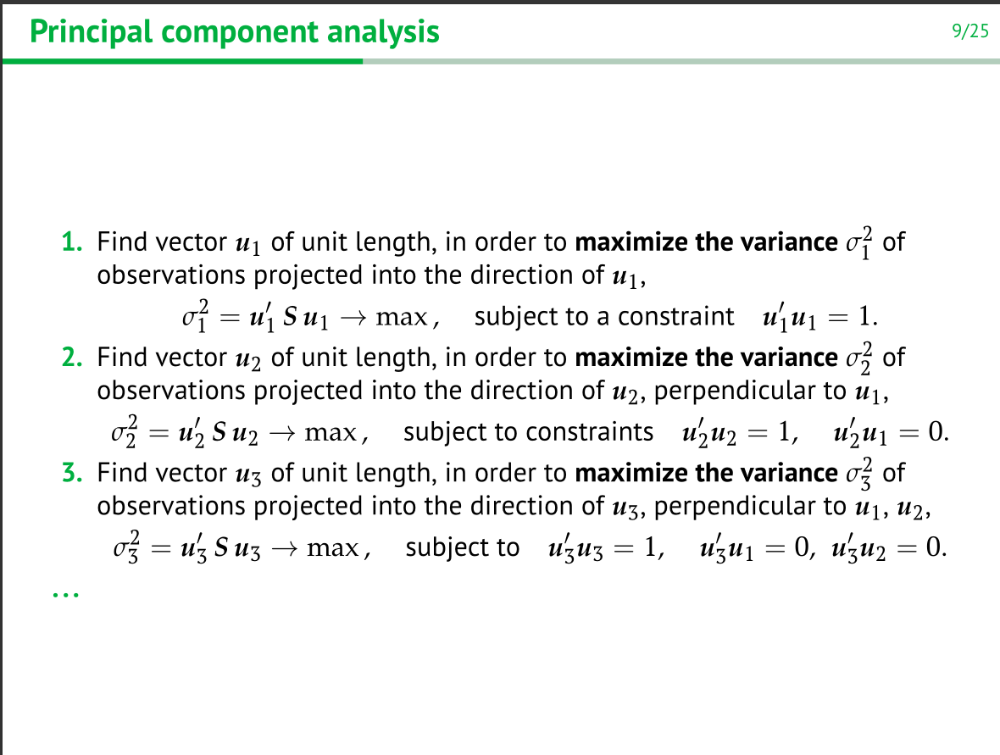\
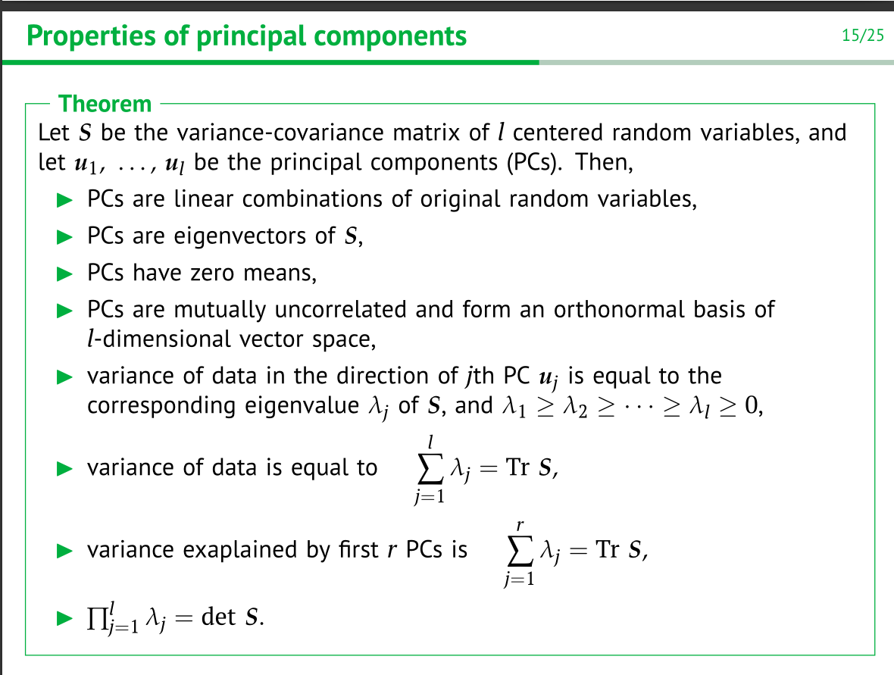
